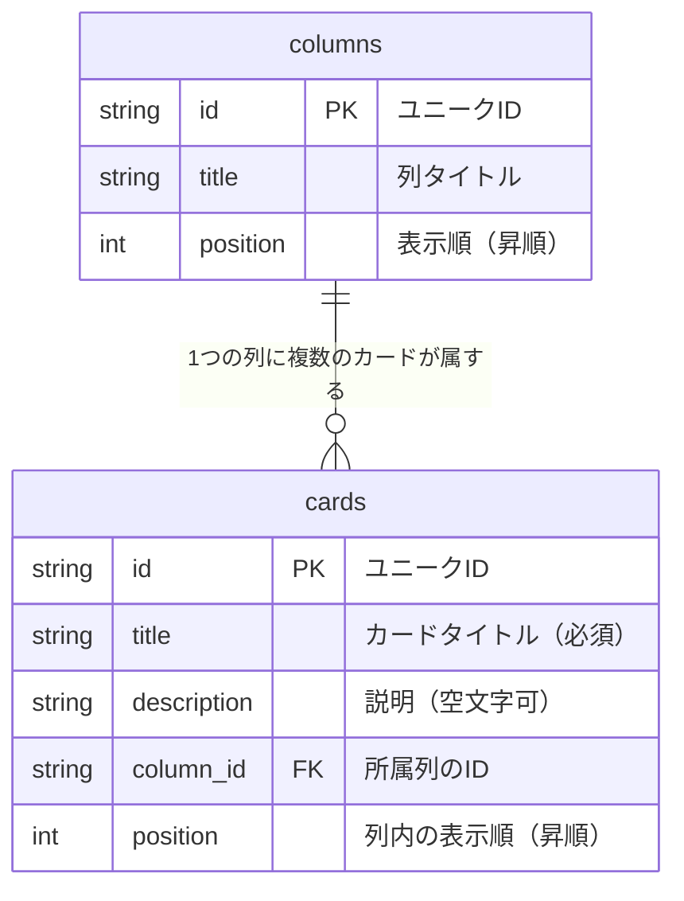
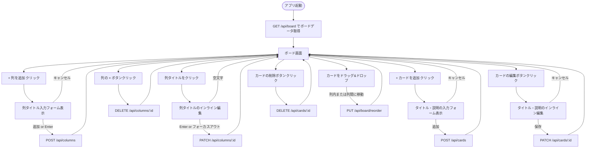
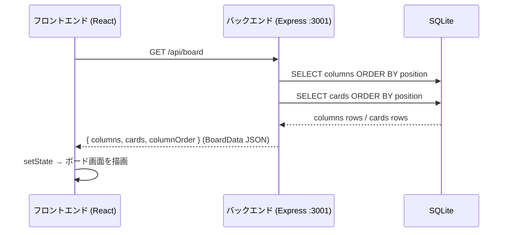
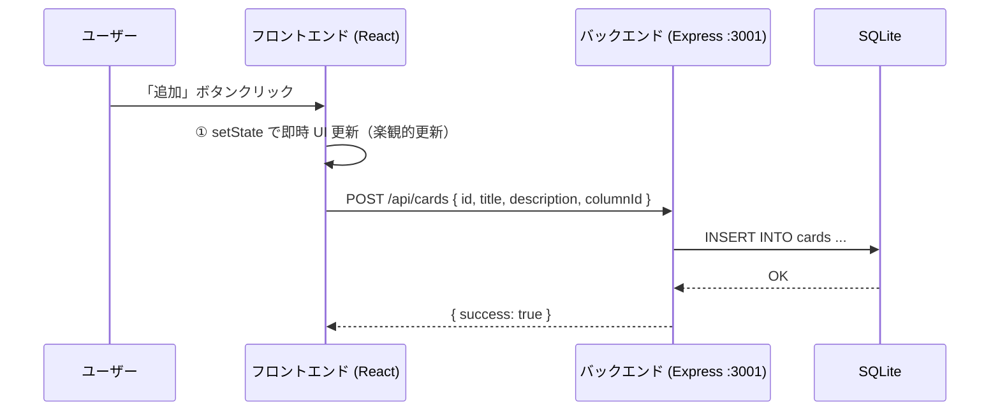
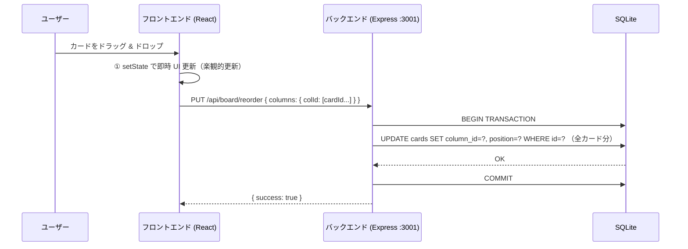
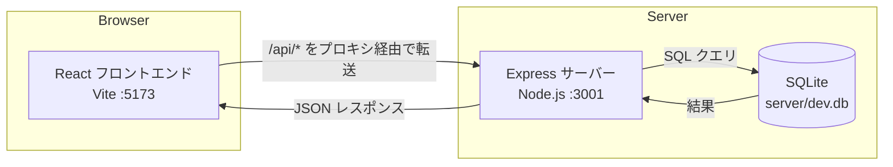

# タスクボード アプリ 設計資料

**プロジェクト名:** タスクボード (🐾 タスクボード)  
**作成日:** 2026-05-23  
**バージョン:** 1.0.0

---

## 1. ER 図

データベースのテーブル構造と関連を示す。

**設計のポイント:**
- `columns.position` / `cards.position` で表示順序を管理する
- カードの列移動・並び替えはこの `position` を一括更新する
- `columns` を削除すると `cards` も CASCADE 削除される（外部キー制約）

---

## 2. テーブル定義

### 2.1 `columns` テーブル（列）

| カラム名 | データ型 | 制約 | デフォルト値 | 説明 |
|---------|---------|------|-------------|------|
| `id` | TEXT | PRIMARY KEY | — | ユニークID（例: `"col-1"`, `"id-1748000000000-ab3cd"`） |
| `title` | TEXT | NOT NULL | — | 列タイトル。空文字は許容しない |
| `position` | INTEGER | NOT NULL | `0` | 表示順序。昇順で並べる（0始まり） |

**制約まとめ:**
- `id` の重複は不可（PRIMARY KEY）
- `title` は必須（NOT NULL）
- `position` が同じ値になっても動作上は問題ないが、`ORDER BY position` で常に一意な順序になるよう API 側で管理する

---

### 2.2 `cards` テーブル（カード）

| カラム名 | データ型 | 制約 | デフォルト値 | 説明 |
|---------|---------|------|-------------|------|
| `id` | TEXT | PRIMARY KEY | — | ユニークID（例: `"card-1"`, `"id-1748000000000-xy9zw"`） |
| `title` | TEXT | NOT NULL | — | カードタイトル。空文字は許容しない |
| `description` | TEXT | NOT NULL | `''` | 説明文。空文字可（省略時は空文字として保存） |
| `column_id` | TEXT | NOT NULL, FOREIGN KEY → `columns(id)` ON DELETE CASCADE | — | 所属する列の ID |
| `position` | INTEGER | NOT NULL | `0` | 列内の表示順序。昇順で並べる（0始まり） |

**制約まとめ:**
- `column_id` は `columns.id` への外部キー。参照先の列が削除されると、その列に属するカードも自動的に削除される（CASCADE）
- `position` は同一列内での順序を表す。D&D 操作後に `PUT /api/board/reorder` で一括更新される

---

### 2.3 テーブル間のリレーション

| 関係 | 種別 | 説明 |
|------|------|------|
| `columns` → `cards` | 1 対 多 | 1 つの列に 0 件以上のカードが属する |

**PRAGMA 設定（接続時に毎回適用）:**

| PRAGMA | 設定値 | 目的 |
|--------|--------|------|
| `journal_mode` | `WAL` | 読み書き競合を減らし、パフォーマンスを向上 |
| `foreign_keys` | `ON` | 外部キー制約と CASCADE を有効化（SQLite はデフォルト OFF） |

---

## 3. 画面遷移図

ユーザー操作に応じた画面・状態の遷移を示す。

---

## 4. データフロー図

フロントエンド・バックエンド・DB 間のデータの流れを示す。

### 4.1 初回読み込み

### 4.2 カードの追加（楽観的更新）

### 4.3 ドラッグ&ドロップによる並び替え

---

## 5. システム構成図

**開発時のプロキシ設定:**  
Vite の `proxy` 設定により、フロントエンドからの `/api/*` リクエストは自動的に `http://localhost:3001` へ転送される。クロスオリジン問題なしに開発できる。

---

## 6. REST API 一覧

| メソッド | パス | 説明 |
|---------|------|------|
| GET | `/api/board` | ボード全体（列・カード）を取得 |
| POST | `/api/columns` | 列を追加 |
| PATCH | `/api/columns/:id` | 列名を変更 |
| DELETE | `/api/columns/:id` | 列を削除（カードも CASCADE 削除） |
| POST | `/api/cards` | カードを追加 |
| PATCH | `/api/cards/:id` | カードを編集 |
| DELETE | `/api/cards/:id` | カードを削除 |
| PUT | `/api/board/reorder` | D&D 後のカード位置・列を一括更新 |
